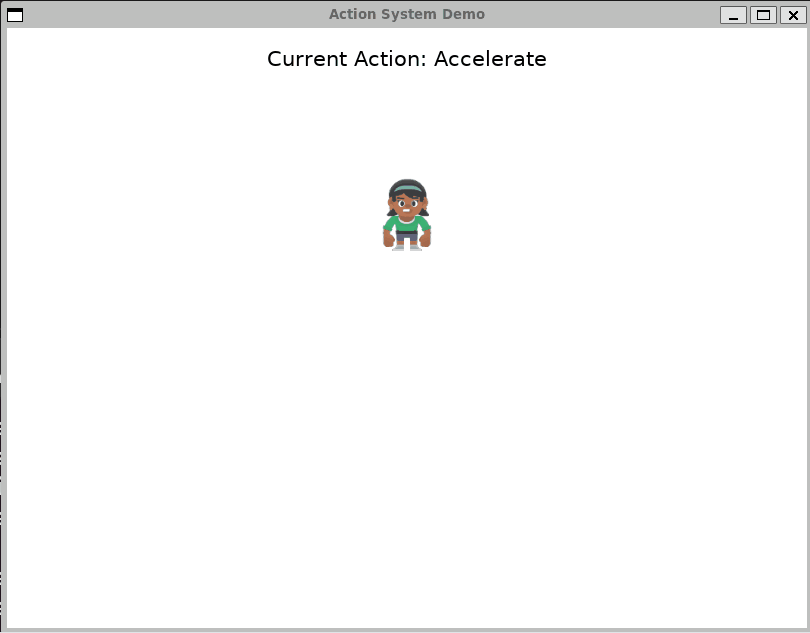

# ArcadeActions
A port of the Cocos2D Actions module to Arcade 3.0.
Tested with WSL2/Ubuntu and Windows 11.

On Ubuntu, install dependencies with `make install`

Run the demo with `make run`

Some of the demo in action:

